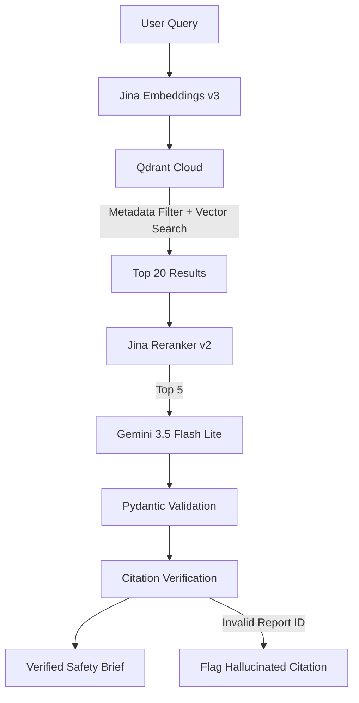

# SafeCheck AI 💊

### Evidence-grounded drug safety analysis from real FDA adverse-event data

[](https://www.python.org/)
[](https://streamlit.io/)
[](https://qdrant.tech/)
[](https://jina.ai/)
[](https://docs.pydantic.dev/)

**SafeCheck AI** is a retrieval-augmented generation (RAG) system that transforms raw **FDA adverse-event reports** into structured drug safety briefs with **verifiable, report-level citations**.

The system is designed around a simple principle:

> **An LLM-generated citation is not trusted until the application verifies that the cited report actually exists in the retrieved evidence.**

Unlike typical RAG demonstrations built on clean documents, SafeCheck AI operates on messy, highly structured pharmacovigilance data from the **openFDA Drug Event API**.

---

## ✨ Key Features

* 🔎 **Evidence-grounded RAG** over real openFDA adverse-event records
* 🧹 **Structured-data transformation** from coded FDA fields into semantic retrieval chunks
* 💊 **Suspect-drug filtering** to reduce incorrect attribution from concomitant medications
* 🧬 **Semantic retrieval** using Jina Embeddings v3
* 🎯 **Cross-encoder reranking** using Jina Reranker v2
* 🤖 **Structured LLM generation** using Gemini 3.5 Flash Lite
* 🛡️ **Pydantic schema validation** for generated safety findings
* 🔗 **Programmatic citation verification** against retrieved report IDs
* 🔄 **Retry and exponential backoff** for external API reliability
* 📊 **Retrieval evaluation** using Recall@5 and Precision@5
* 🖥️ **Streamlit interface** for interactive drug safety analysis

---

## 🧠 Why This Project Is Different

Most RAG tutorials follow a relatively clean pipeline:

```text
Document
   ↓
Chunk
   ↓
Embed
   ↓
Retrieve
   ↓
Generate
```

SafeCheck AI had to solve a harder problem first:

```text
Messy structured FDA data
        ↓
Decode coded fields
        ↓
Resolve drug attribution
        ↓
Construct semantic evidence
        ↓
Embed + retrieve
        ↓
Rerank
        ↓
Generate structured findings
        ↓
Verify citations
        ↓
Safety brief
```

The interesting engineering work happens **before the LLM is even called**.

---

# 🏗️ Architecture



### Pipeline

| Stage               | Component             | Responsibility                                  |
| ------------------- | --------------------- | ----------------------------------------------- |
| **1. Ingestion**    | openFDA API           | Fetch adverse-event records                     |
| **2. Flattening**   | Python                | Decode structured fields and construct evidence |
| **3. Embedding**    | Jina Embeddings v3    | Convert evidence into semantic vectors          |
| **4. Storage**      | Qdrant Cloud          | Store vectors and metadata                      |
| **5. Retrieval**    | Qdrant                | Metadata-filtered vector search                 |
| **6. Reranking**    | Jina Reranker v2      | Re-score retrieved evidence                     |
| **7. Generation**   | Gemini 3.5 Flash Lite | Generate structured safety findings             |
| **8. Validation**   | Pydantic              | Enforce output schema                           |
| **9. Verification** | Python                | Validate every cited report ID                  |
| **10. UI**          | Streamlit             | Present the final safety brief                  |

---

# 🔬 Working With Messy FDA Data

The openFDA Drug Event API does not provide a clean corpus of medical narratives.

A typical record contains coded and nested fields:

```json
{
  "safetyreportid": "10004814",
  "serious": "1",
  "seriousnesshospitalization": "1",
  "patient": {
    "patientonsetage": "4",
    "patientonsetageunit": "804",
    "patientsex": "1",
    "reaction": [
      {
        "reactionmeddrapt": "Intraventricular haemorrhage neonatal"
      }
    ],
    "drug": [
      {
        "medicinalproduct": "IBUPROFEN",
        "drugcharacterization": "1"
      }
    ]
  }
}
```

Embedding the raw JSON directly would preserve the structure but provide poor semantic context.

SafeCheck AI instead transforms the record into an evidence-oriented representation:

```text
4-hours-old male patient reported Intraventricular haemorrhage
neonatal following use of IBUPROFEN. Outcome: serious —
hospitalization. Reported: 2014-03-12. Report ID: 10004814.
```

This preserves the original report ID while giving the embedding model a meaningful semantic representation.

---

## 📌 Data Problems Solved

### 1. No narrative text

In a sample of **500 ibuprofen records**, none contained usable free-text clinical narratives.

The information was primarily represented through:

* MedDRA reaction terms
* Seriousness flags
* Patient demographics
* Drug characterization codes
* Outcome fields
* Report metadata

The pipeline therefore synthesizes retrieval text directly from structured fields.

---

### 2. Multi-drug contamination

Adverse-event reports can contain multiple administered drugs.

A naive query for:

```text
ibuprofen adverse events
```

could retrieve a report where ibuprofen was merely administered alongside another drug responsible for the reported event.

SafeCheck AI distinguishes between:

```text
drugcharacterization = suspect
drugcharacterization = concomitant
```

Records where the target drug is only concomitant are excluded from the target-drug knowledge base.

In the initial 500-record ibuprofen sample:

**61.2% of records were removed by the suspect-drug filtering stage.**

This reduces the risk of attributing another medication's adverse event to the target drug.

---

### 3. Age fields require unit decoding

The obvious field:

```text
patientagegroup
```

was populated in only **8.2%** of sampled records.

The more useful fields were:

```text
patientonsetage
patientonsetageunit
```

The pipeline decodes units such as:

* Years
* Months
* Weeks
* Days
* Hours

For example:

```text
patientonsetage = 4
patientonsetageunit = 804
```

represents a patient **4 hours old**, not 4 years old.

This distinction is particularly important for pediatric adverse-event analysis.

---

# 📊 Data Transformation

The initial ibuprofen sample demonstrates the effect of the preprocessing pipeline:

```text
500 Raw FDA Records
        │
        ▼
Structured-field decoding
        │
        ▼
Suspect-drug filtering
        │
        ▼
Semantic sentence synthesis
        │
        ▼
194 Retrieval Chunks
```

Each usable chunk retains its original **FDA report ID**, preserving provenance from retrieval all the way through final generation.

---

# 🛡️ Citation Verification

One of the central engineering goals of SafeCheck AI is to prevent the LLM from inventing report citations.

The model is required to produce structured findings:

```python
class Finding(BaseModel):
    claim: str
    report_ids: list[str]
    confidence: float
```

After generation, every cited report ID is independently checked against the retrieved evidence.

```python
def check_citations(
    brief: SafetyBrief,
    retrieved_chunks: list[dict]
) -> dict:

    valid_ids = {
        chunk["report_id"]
        for chunk in retrieved_chunks
    }

    hallucinated = [
        report_id
        for finding in brief.findings
        for report_id in finding.report_ids
        if report_id not in valid_ids
    ]

    return {
        "hallucinated_ids": hallucinated,
        "hallucination_free": len(hallucinated) == 0
    }
```

### Verification flow

```text
Gemini Output
     │
     ▼
Pydantic Validation
     │
     ▼
Extract report IDs
     │
     ▼
Compare against retrieved IDs
     │
 ┌───┴────┐
 │        │
Valid   Missing
 │        │
 ▼        ▼
Accept   Flag as
         hallucinated
```

The model generates the citation.

**The application decides whether the citation is valid.**

---

# 📈 Evaluation

SafeCheck AI includes a manually labeled evaluation set covering **8 safety-oriented queries** across:

* GI adverse events & ulcer perforation
* Renal impairment & acute kidney injury
* Pediatric angioedema reactions
* Severe cutaneous adverse reactions (Stevens-Johnson syndrome, AGEP)
* Pulmonary haemorrhage & haemoptysis
* Misuse/abuse complications (Renal tubular acidosis & hypokalaemia)
* Non-serious drug hypersensitivity reactions

Each query is mapped to relevant report IDs confirmed against the underlying raw records.

### Metrics

| Metric                          | What it measures                                                                        |
| ------------------------------- | --------------------------------------------------------------------------------------- |
| **Recall@5**                    | Percentage of relevant report IDs retrieved in the top 5                                |
| **Precision@5**                 | Percentage of top-5 retrieved chunks that are relevant                                  |
| **Citation Hallucination Rate** | Percentage of generated citations referencing report IDs absent from retrieved evidence |

Run the evaluation suite:

```bash
python -m src.evaluation
```

---

# 🧰 Tech Stack

| Category        | Technology                 | Purpose                            |
| --------------- | -------------------------- | ---------------------------------- |
| Language        | **Python**                 | End-to-end implementation          |
| Data Source     | **openFDA Drug Event API** | Real adverse-event reports         |
| Embeddings      | **Jina Embeddings v3**     | Semantic representation            |
| Vector Database | **Qdrant Cloud**           | Metadata-filtered vector retrieval |
| Reranking       | **Jina Reranker v2**       | Cross-encoder relevance scoring    |
| LLM             | **Gemini 3.5 Flash Lite**  | Structured safety-brief generation |
| Validation      | **Pydantic**               | Schema enforcement                 |
| Reliability     | **Tenacity**               | Retry + exponential backoff        |
| UI              | **Streamlit**              | Interactive application            |

---

# 📁 Project Structure

```text
safecheck-ai/
│
├── data/
│   ├── raw/
│   │   └── # Raw openFDA JSON records
│   │
│   └── chunks/
│       └── # Flattened retrieval chunks
│
├── src/
│   ├── config.py
│   ├── schema.py
│   ├── ingest.py
│   ├── flatten.py
│   ├── embed_and_store.py
│   ├── retriever.py
│   ├── generate.py
│   └── evaluation.py
│
├── app.py
├── requirements.txt
├── .env.example
└── README.md
```

### Core modules

| File                 | Responsibility                                                  |
| -------------------- | --------------------------------------------------------------- |
| `ingest.py`          | Fetches openFDA records with pagination and retries             |
| `flatten.py`         | Decodes fields, filters drug roles, and creates evidence chunks |
| `embed_and_store.py` | Generates embeddings and stores vectors in Qdrant               |
| `retriever.py`       | Performs metadata-filtered retrieval and reranking              |
| `generate.py`        | Generates structured safety briefs and verifies citations       |
| `evaluation.py`      | Evaluates retrieval and citation quality                        |
| `schema.py`          | Defines AdverseEventChunk Pydantic model                        |
| `config.py`          | Configuration and environment variables                         |
| `app.py`             | Streamlit application                                           |

---

# 🚀 Getting Started

## Prerequisites

* Python 3.x
* openFDA API access (optional API key)
* Qdrant Cloud account
* Jina AI API key
* Google Gemini API key

## 1. Clone the repository

```bash
git clone https://github.com/rugged-code/SafeCheck-AI.git
cd SafeCheck-AI
```

## 2. Install dependencies

```bash
pip install -r requirements.txt
```

## 3. Configure environment variables

Copy `.env.example` to `.env` and fill in your credentials:

```bash
cp .env.example .env
```

```env
OPENFDA_API_KEY=your_key            # Optional (raises openFDA rate limit)
QDRANT_URL=your_qdrant_url
QDRANT_API_KEY=your_qdrant_api_key
JINA_API_KEY=your_jina_api_key
GEMINI_API_KEY=your_gemini_api_key  # or GOOGLE_API_KEY
```

**Never commit your `.env` file or API keys to GitHub.**

## 4. Start the application

```bash
streamlit run app.py
```

The application accepts a drug and safety-related query, retrieves relevant evidence, generates a structured safety brief, and verifies the report IDs cited by the model.

---

# ⚙️ Engineering Decisions

### Evidence-first generation

The LLM receives retrieved evidence rather than being allowed to answer solely from its general model knowledge.

### Structured generation

Pydantic models constrain the output into predictable fields:

```text
Claim
Report IDs
Confidence
```

### Provenance preservation

Every retrieval chunk retains its source FDA report ID.

This allows:

```text
Generated Claim
      ↓
Report ID
      ↓
Retrieved Chunk
      ↓
Original FDA Record
```

### Explicit drug attribution

Suspect and concomitant drugs are distinguished during preprocessing to reduce cross-drug attribution errors.

### Independent citation verification

Citation validity is checked programmatically after generation instead of relying solely on prompting.

### Framework-light implementation

The core RAG pipeline is implemented directly in Python rather than relying on a large orchestration framework.

This keeps retrieval, reranking, prompting, validation, and verification behavior explicit and inspectable.

---

# 🧪 What This Project Demonstrates

SafeCheck AI is less about building another chatbot and more about exploring how to make RAG systems **traceable and failure-aware**.

The project demonstrates:

* Working with messy real-world structured data
* Designing retrieval-friendly representations
* Entity-aware filtering
* Vector retrieval
* Cross-encoder reranking
* Structured LLM generation
* Schema validation
* Citation provenance
* Automated hallucination checks
* Retrieval evaluation
* External API reliability

The central lesson was simple:

> **The difficult part of RAG is often deciding what evidence should enter the retrieval system in the first place.**

---

# ⚠️ Limitations

SafeCheck AI is a research and engineering project, not a clinical decision-support system.

Important limitations include:

* FDA adverse-event reports are spontaneous reports and do not establish causality by themselves.
* The current evaluation dataset is relatively small.
* Retrieval quality depends on the coverage and quality of the underlying reports.
* Generated summaries should not be interpreted as medical advice.
* The system is intended to demonstrate evidence-grounded RAG engineering, not replace pharmacovigilance professionals or regulatory databases.

---

# 🗺️ Roadmap

* [ ] Expand the evaluation dataset
* [ ] Add automated retrieval regression tests
* [ ] Support additional drug classes
* [ ] Improve chunk-level provenance visualization
* [ ] Add retrieval failure analysis
* [ ] Compare embedding and reranking models
* [ ] Generate automated evaluation reports
* [ ] Improve evidence exploration in the UI

---

# 🔐 Disclaimer

**SafeCheck AI is an engineering/research project for exploring evidence-grounded RAG over adverse-event data. It is not a medical device, diagnostic system, or substitute for professional medical advice.**

The underlying adverse-event reports are sourced from publicly available FDA data. Individual adverse-event reports should not be interpreted as establishing that a drug caused a particular event.

---

## Built With

**Python · openFDA · Jina AI · Qdrant · Gemini · Pydantic · Streamlit**

---

<p align="center">
  Built to explore one question:
  <br>
  <strong>Can an LLM's citations be trusted when the underlying data is messy?</strong>
</p>
